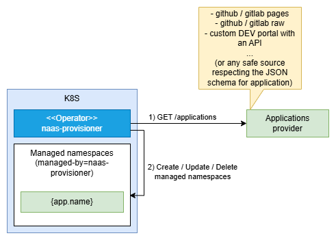

# naas-provisioner

An **experimental** operator provisioning K8S namespaces according to a list of applications provided by an URL :



## Motivation

- Provisioning namespaces for students.
- Dynamic provisioning from an external application catalog (ex : naas-provisioner, k8slab, betalab,...).

## Warning

- DON'T USE THIS ON A PROD CLUSTER!
- DON'T USE THIS WITH ACCESS TO A PROD CLUSTER CONFIGURED IN YOUR KUBECONFIG!

## Features

Given a collection of applications provided as an URL (see [docs/samples-applications.yaml](docs/samples-applications.yaml)) this tool run a loop to :

- Create, update or remove the corresponding namespaces with `app.name` == `namespace.name`
- Configure a `"naas-providers-admins"` RoleBinding with the `"admin"` ClusterRole on the namespace for the `app.admins`.

Note that :

- A `managed-by=naas-provisioner` label is configured on the resources (existing namespace without this label are ignored)
- It might be extended in the futur to configure Quotas, NetworkPolicies,...

## Parameters

| Name                         | Description                                             | Default             |
| ---------------------------- | ------------------------------------------------------- | ------------------- |
| `NAAS_APPLICATIONS_URL`      | The URL of the YAML files defining the applications (1) | None (**required**) |
| `NAAS_ADMINS_CLUSTER_ROLE`   | The ClusterRole assigned to the app admins              | "admin"             |
| `NAAS_DRY_RUN`               | Set to 1 to display operations                          | 0                   |
| `NAAS_POLL_INTERVAL_SECONDS` | Update loop frequency                                   | 30                  |

> (1) A path like examples/applications.yaml is allowed for development purpose.

## Usage

### For development purpose

**WARNING : it will use the current context in your KUBECONFIG!**

```bash
# Configure applications source
export NAAS_APPLICATION_URL=docs/sample-applications.yaml

# WARNING : check your current context before switching to 0
export NAAS_DRY_RUN=1

# Run synchronize loop
uv run naas-provisioner --loop
```

### Deploying in Kubernetes

> **in progress**

See [docs/deploy/demo.yaml](docs/deploy/demo.yaml) :

```bash
# temporary
docker build -t ghcr.io/mborne/naas-provisioner:main .
kind load docker-image ghcr.io/mborne/naas-provisioner:main --name devbox

# deploy
kubectl apply -f docs/deploy/demo.yaml
```


## Testing

```bash
uv sync --extra=dev
uv run pytest
```

## License

[MIT](LICENSE)
